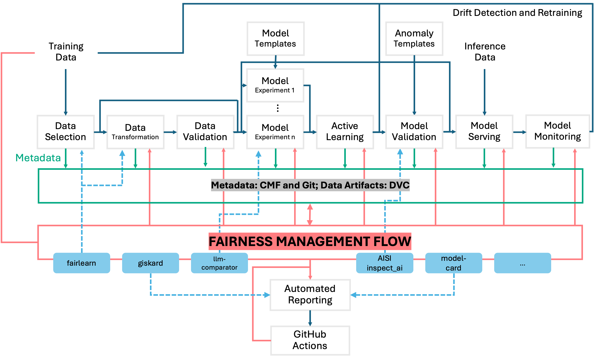

# Using FAID in Scope of ICO’s Data Protection by Design and Default Approach

FAID (Fair AI Development) is an open-source fairness monitoring and management tool that developers can integrate into their machine learning (ML) pipelines. As the developers of FAID, it is also our shared responsibility to guide other developers on how to integrate FAID in a fairness by design approach.

FAID is not a data privacy or security application. However, as a developer, it is also our shared responsibility to guide other developers on how to integrate FAID in a privacy and security “by design” approach.

## Integrating an open-source project into your codebase

The security of open-source projects is a subject of ongoing debate with varying perspectives, often depending on the specific use case. Some open-source projects are critical to digital public infrastructure and benefit from active contributor communities, often supported by public and private funding. This support helps ensure close monitoring and transparency in the event of an attack. However, many open-source projects are maintained by volunteers with limited resources, which can lead to vulnerabilities and a lack of resilience against attacks.

Like many open-source projects, FAID is maintained by two researchers funded by UKRI Innovate UK. The tool is currently in a research preview phase. Despite our efforts to address the latest security vulnerabilities, FAID may still include other vulnerable Python packages. When integrating any open-source libraries, it's important to use sandboxes and closely monitor data flow.

## Data flow of FAID

The following diagram illustrates a high-level overview of FAID's dataflow. Note that the library does not interact with model training data or system-level data. It only collects metadata information if the developer explicitly decides to include it into fairness management flow.



## Data Protection Checklist After Integrating FAID

*The below list is adopted from [ICO](https://ico.org.uk/for-organisations/uk-gdpr-guidance-and-resources/accountability-and-governance/guide-to-accountability-and-governance/accountability-and-governance/data-protection-by-design-and-default/). You can also customise this checklist for integrating other open-source software based on your needs.*

- [ ] We thoroughly analyse the dataflow after integrating FAID to detect possible data protection issues as part of the design and implementation of our systems, services, products and business practices.
- [ ] We make data protection rules an essential component of the core functionality of our processing systems and services. We ensured that FAID is working under these rules.
- [ ] We included FAID into our risk register. We do not anticipate risks and privacy-invasive events due to this integration. We can identify possible risks before they occur and take steps to prevent harm to individuals.
- [ ] We only feed personal data to FAID that is needed for our purposes relating increasing fairness, and that we only use the data for those purposes.
- [ ] We ensure that any of FAID’s input and output personally identifiable data is automatically protected in any IT system.
- [ ] We reviewed and updated our data protection policy after the use of FAID  to provide individuals with tools so they can determine how we are using their personal data, and whether our policies are being properly enforced.
- [ ] When we use other systems, services or products in our processing activities, we make sure that we only use those whose designers and manufacturers take data protection issues into account.

## Useful FAID features while filling out this checklist

1. Generate data flow reports after each release: FAID can generate data flow diagrams. You can integrate these diagrams in your continuous deployment reports and send these reports to the DPO in your organisation.

```
#TODO: Add example use
```
2. Include the checklist at the end of each report: This checklist can programmatically be included in every report to initiate a cross-disciplinary discussion.

```
#TODO: Add example use
```
